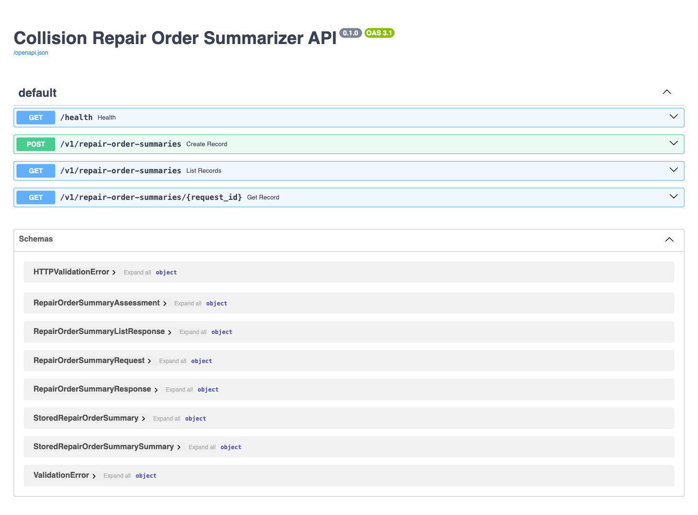
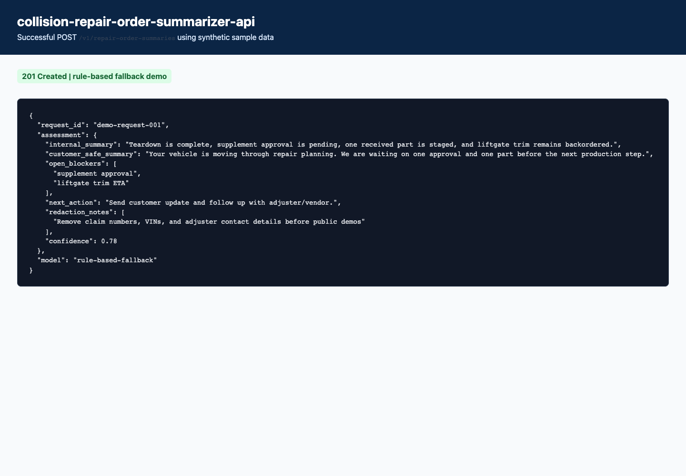

# Collision Repair Order Summarizer API

        A deployable FastAPI service for Precision Auto Body's **Repair-order summarizer** workflow. It demonstrates typed AI outputs, deterministic fallback behavior, SQLite audit persistence, production-style JSON logging, Docker packaging, CI, Railway deployment notes, and synthetic public demo data.

        > This service is an assistive workflow tool. It does not make final safety, repair, insurance, financial, or outbound communication decisions.

        ## Live demo

        Add Railway URLs after deployment:

        - API health: `https://<railway-domain>/health`
        - Swagger docs: `https://<railway-domain>/docs`

        

        

        ## Case study

        ### Business problem

        Repair orders accumulate notes, parts issues, supplement events, and customer messages that are hard to scan quickly.

        ### Workflow context

        This service turns synthetic repair-order notes into internal and customer-safe summaries. The public version is synthetic-first: every fixture is made-up and safe to publish.

        ### Architecture

        ```mermaid
        flowchart LR
            Client["Client / workflow tool"] --> API["FastAPI service"]
            API --> Validation["Pydantic validation"]
            Validation --> Model["OpenAI structured output or deterministic fallback"]
            Model --> Assessment["Typed RepairOrderSummaryAssessment"]
            Assessment --> Store["SQLite audit database"]
            Store --> Response["JSON response and retrievable record"]
        ```

        ### What it returns

        - `internal_summary`
- `customer_safe_summary`
- `open_blockers`
- `next_action`
- `redaction_notes`
- `confidence`

        ### Measurable impact hypothesis

        A production version could reduce manual review time for this workflow by turning scattered notes into structured handoffs, missing-item checks, and human-approved next actions.

        ## API endpoints

        - `POST /v1/repair-order-summaries` creates a workflow assessment.
        - `GET /v1/repair-order-summaries` lists recent assessment summaries.
        - `GET /v1/repair-order-summaries/{request_id}` retrieves a stored assessment.
        - `GET /health` supports deployment health checks.

        ## Example request

        ```bash
        curl -X POST http://localhost:8000/v1/repair-order-summaries \
          -H 'Content-Type: application/json' \
          -d @sample_data/sample_request.json
        ```

        ## Example response

        ```json
        {
  "request_id": "demo-request-001",
  "assessment": {
    "internal_summary": "Teardown is complete, supplement approval is pending, one received part is staged, and liftgate trim remains backordered.",
    "customer_safe_summary": "Your vehicle is moving through repair planning. We are waiting on one approval and one part before the next production step.",
    "open_blockers": [
      "supplement approval",
      "liftgate trim ETA"
    ],
    "next_action": "Send customer update and follow up with adjuster/vendor.",
    "redaction_notes": [
      "Remove claim numbers, VINs, and adjuster contact details before public demos"
    ],
    "confidence": 0.78
  },
  "model": "rule-based-fallback"
}
        ```

        ## Run locally

        ```bash
        python -m venv .venv
        source .venv/bin/activate
        pip install -r requirements.txt
        cp .env.example .env
        uvicorn app.main:app --reload
        ```

        Open Swagger UI at `http://localhost:8000/docs`.

        ## Run with Docker

        ```bash
        docker build -t collision-repair-order-summarizer-api .
        docker run --rm -p 8000:8000 --env-file .env collision-repair-order-summarizer-api
        ```

        ## Deploy on Railway

        1. Push this repository to GitHub.
        2. Create a Railway project from the GitHub repository.
        3. Railway will detect the `Dockerfile` and use `railway.toml` for the `/health` deployment check.
        4. Add service variables:

        ```text
        APP_ENV=production
        LOG_LEVEL=INFO
        OPENAI_API_KEY=<your key>
        OPENAI_MODEL=gpt-5-mini
        REQUEST_TIMEOUT_SECONDS=30
        DATABASE_PATH=/data/repair_order_summary.db
        ```

        5. Add a volume mounted at `/data` so saved records survive redeploys.
        6. Generate a public domain from the service Networking settings.

        ## Test

        ```bash
        pytest -q
        ruff check .
        ruff format --check .
        docker build -t collision-repair-order-summarizer-api:ci .
        ```

        ## Production considerations

        - Keep customer, VIN, claim, phone, email, insurer, and photo data out of public demos.
        - Put the container behind HTTPS and an authenticated gateway.
        - Add rate limiting before public production traffic.
        - Human review remains required for safety, repair, insurance, financial, and outbound communication decisions.
        - Validate CCC ONE, Gmail, Google Calendar, Google Drive, QuickBooks, vendor, and carrier access before live integrations.

        ## Portfolio talking points

        - Designed a typed AI workflow API around a real collision repair operating process.
        - Used synthetic fixtures so the project is public-safe.
        - Implemented deterministic fallback behavior so demos and tests work without an API key.
        - Added request IDs, JSON logs, persistence, health checks, validation, tests, Docker, and Railway deployment notes.
